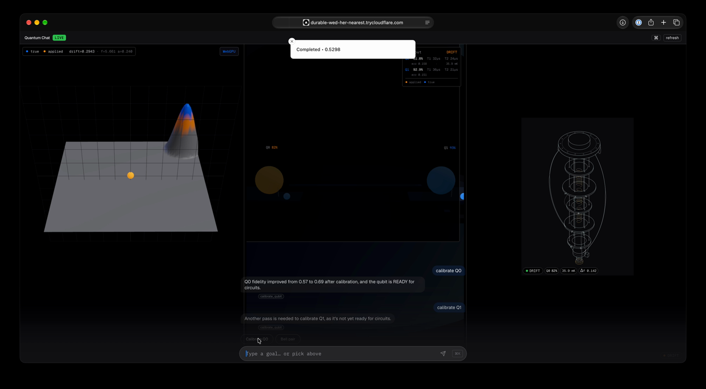
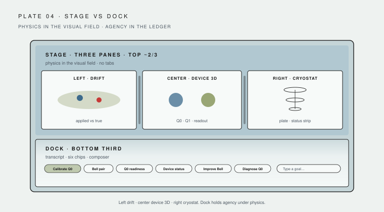
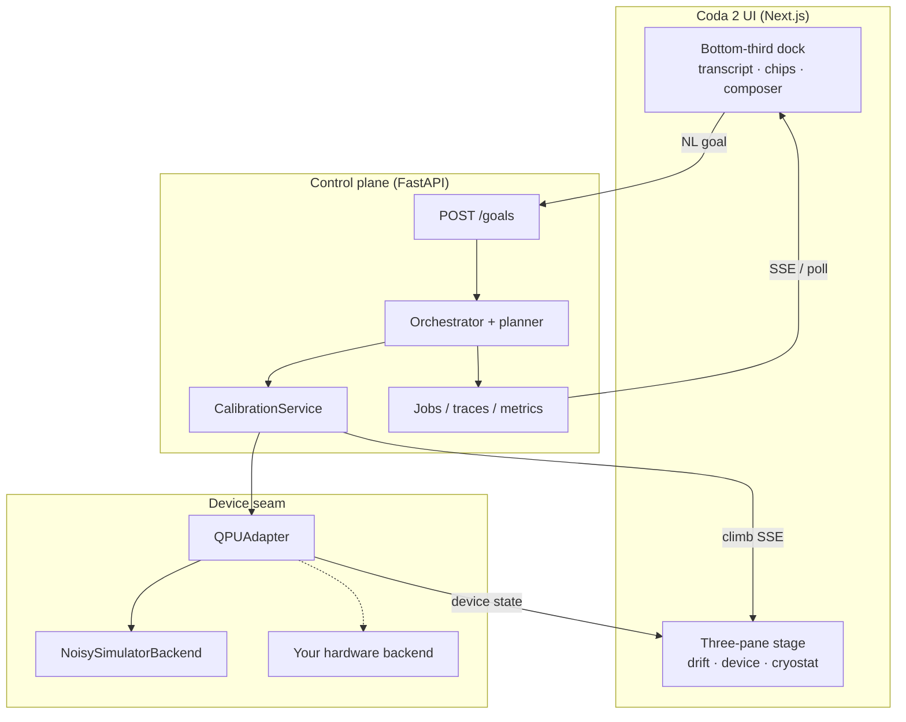
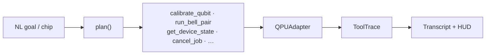
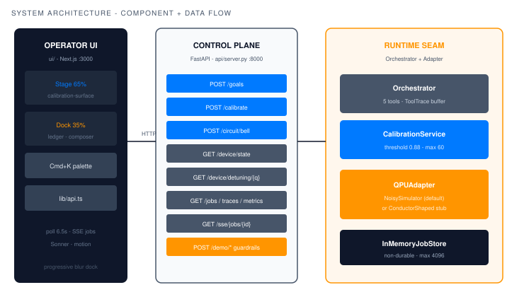
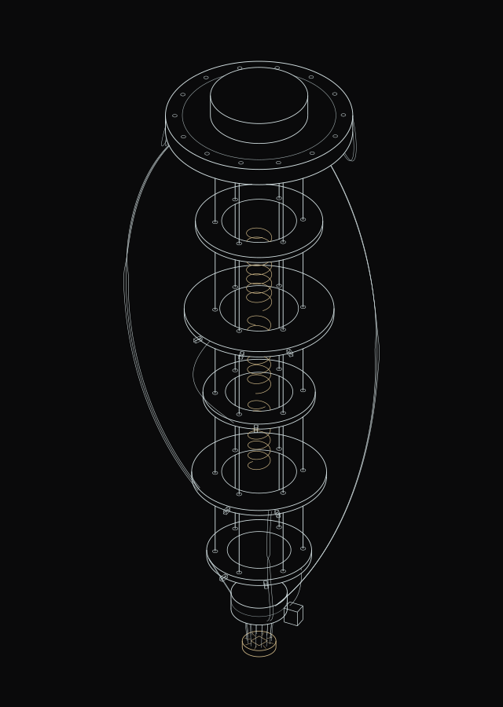

# [Coda 2](docs/manual/coda-2-manual.pdf)

**Natural language → quantum processing unit.**

Coda 2 starts from a single question: what should the surface of a quantum machine look like when the person in front of it speaks plain language? Not a chat window bolted onto a terminal, but an instrument — a three-pane stage of live device physics, a dock of typed goals, and a stream of numbers that can be argued with. Short goals become typed control-plane tools; every tool call leaves a trace; the device stays honest about the fact that it is probabilistic.

  

<video src="docs/media/demo.webm" poster="docs/media/demo-poster.png" controls width="100%">
  <a href="docs/media/demo.webm">Download the demo video (WebM)</a>
</video>

  <a href="docs/media/demo.webm">Demo (WebM)</a>
  ·
  <a href="docs/media/demo.mov">Demo (MOV)</a>

## Why this matters

Quantum hardware is still operated by specialists. A real session today means lab-specific scripts, hand-maintained notebooks, and a mental model of a machine that lives inside a dilution refrigerator, behind a stack of control electronics. Someone has to know which knob is which, what the last calibration sweep returned, and whether the numbers currently on the screen were taken before or after the fridge warmed by a few millikelvin.

That knowledge decays. Qubit frequencies wander, coherence times shift with temperature, and thresholds that were comfortably met this morning may be marginal by lunch. Calibration is not a phase you complete; it is a steady-state practice, and its cost is measured in expert attention.

The distance between what an operator means and what the machine must do is the interesting part. “Get qubit 0 ready” is one sentence; underneath it sits frequency search, Rabi amplitude and duration tuning, readout optimization, repeated measurement, and a judgment about whether fidelity is good enough to proceed. “Is the Bell pair good enough?” asks for an estimate, the evidence behind it, and a recommendation — not a single float printed into a log.

AI agents are arriving at this layer quickly, and free-form chat is the wrong interface for a physical, probabilistic device. Chat gives fluent prose where you need typed actions; it hides cost and risk; it can sound certain when the physics is not. What this device needs is the opposite: actions that are enumerable and auditable, live state you can watch while the agent works, and uncertainty that stays visible. Coda 2 explores that interface — intent in, a plan made of named tools out, evidence kept on the surface.

## The product concept

Coda 2 is an instrument, not a chatbot. It asks that three languages be spoken at once.

**Visual.** A three-pane stage with draggable splitters: a param-drift landscape where qubit frequencies wander as a terrain you can see change, a 3D device view, and an isometric cryostat that shows the machine you are addressing. The stage is the primary surface; it stays sharp above the fold.

**Text.** A bottom-third dock holds the conversational layer: transcript, six golden-path chips, two observation asks, and a high-contrast composer. Text is how you state intent, not how the device reports its state.

**Math.** Fidelity, Δf, millikelvin, readiness. Every claim the interface makes about the machine resolves to a number with a provenance — a tool call, a trace, a timestamp — rather than an assertion in prose.

A goal typed into the dock is compiled to a typed control-plane tool. Tools are enumerable, so the action space is inspectable: you can see what the system is *able* to do before you trust what it *did*. Each execution produces traces and metrics, so the interaction history is auditable rather than remembered. The core path is offline by default and requires no API keys: the deterministic planner, simulator backend, and UI run end to end on a laptop with no network.

### What you get

| | |
|---|---|
| **Three-pane stage** | Param-drift landscape · 3D device · isometric cryostat — iPadOS-style splitters |
| **Bottom-third dock** | Transcript, six golden-path chips + two observation asks, high-contrast composer — stage stays sharp above the fold |
| **Workflow chips** | Calibrate Q0 → Q0 readiness · Device status → Bell pair → Improve Bell · Diagnose Q0 · What does READY mean? · Why do counts vary? |
| **Multimodal** | Visual stage + NL goals + live math (fidelity, Δf, mK, readiness) |
| **Chat bubbles** | You / agent turns with tool-trace pills; empty-state and chips stay above the tint |
| **Real control plane** | `QPUAdapter` seam, orchestrator + deterministic planner, calibration loop, jobs, traces, FastAPI + SSE |
| **Honest simulation** | `NoisySimulatorBackend` — toy 1–2 qubit device with drift; swap the backend without touching UI or orchestrator |

## How it works

A short natural-language goal becomes a **probabilistic program** on the device — not free-form chat.

1. **NL goal** — chip or typed ask (“Bring qubit 0 to ready”, “Run a Bell pair”).
2. **Planner** — maps the goal to typed control-plane tools (`calibrate_qubit`, `run_bell_pair`, `get_device_state`, …).
3. **Execution** — tools run through `QPUAdapter` on a noisy / probabilistic backend (drift, fidelity from distance, stochastic counts).
4. **Traces → UI** — tool traces, metrics, and live device state stream back into the transcript and three-pane stage.

Same seam for a real QPU: swap the backend; keep the planner, tools, and instrument UI.

  <a href="docs/diagrams/architecture.svg">Architecture</a>
  ·
  <a href="docs/diagrams/ui-layout.svg">UI layout</a>

### Why the output is a program, not an answer

A quantum processing unit returns samples, not results. The counts you get out of a measurement are stochastic, so any statement about the machine — fidelity, readiness, whether a Bell pair is good — is an estimate whose reliability depends on how many shots you were willing to spend. Meanwhile the parameters you estimated drift under you while you measure them: the frequency you found is the frequency of the past.

So the system does not hand back a sentence claiming a fact. It runs a program: declare the goal, choose the actions, spend shots, collect traces, and return an estimate with its evidence attached — shots, per-outcome counts, estimated fidelity, the calibration before and after, and when each number was taken. The answer stays falsifiable, and the transcript shows the work rather than smoothing it over.

A short [quantum literacy](docs/QUANTUM_LITERACY.md) note covers observation, drift, and why recalibration is ongoing — the same ideas the dock can ask in-session.

### The adapter seam

`QPUAdapter` is the only place that knows how the device is reached. Above it sit the planner, the typed tools, and the instrument UI; below it sits `NoisySimulatorBackend` today, and your hardware tomorrow. Swapping in real control electronics means implementing the same contract — submit, poll, and cancel jobs; read device state; read and apply calibration — with nothing above the seam changing. The UI keeps rendering the same drift, fidelity, and readiness surfaces; the traces keep meaning the same thing.

The metrics are what make the claim testable rather than rhetorical: `time_to_calibrated` (how long intent takes to become a ready qubit), `calibration_success_rate` (how often a goal reaches threshold), and `interface_latency` (how long the surface takes to reflect what the device just did). Together they measure the interface, not just the simulation.

### Chips → tools

| Chip | Goal (approx.) | Planner tool |
|------|----------------|--------------|
| Calibrate Q0 | Bring qubit 0 to ready | `calibrate_qubit` |
| Q0 readiness | Report qubit 0 readiness and fidelity status | `get_device_state` |
| Device status | Report device health and temperature status | `get_device_state` |
| Bell pair | Run a Bell pair and report fidelity | `run_bell_pair` (calibrate first if not READY) |
| Improve Bell | Run a precise Bell pair and report fidelity | `run_bell_pair` (more shots; same gate) |
| Diagnose Q0 | Check qubit 0 health and readout status | `get_device_state` |
| What does READY mean? | What does READY mean? | `get_device_state` (live numbers + observation note) |
| Why do counts vary? | Why do counts vary? | `get_device_state` (live numbers + observation note) |

### Real vs simulated

**Real (control plane):** `QPUAdapter`, orchestrator + planner, tool traces, calibration service, FastAPI (`/goals`, `/jobs`, `/traces`, `/metrics`, `/device/*`, SSE), Next.js instrument UI.

**Simulated (hardware model):** `NoisySimulatorBackend` — hidden true params, drift, fidelity from distance, stochastic Bell counts. Replace the backend; keep the contract.

## Optional LLM planner / narrator

The default path is fully local: a deterministic planner matches goals to tools, and a template narrator renders the reply. If an OpenAI-compatible provider key is present in the environment (NVIDIA NIM, Groq, OpenAI), a model-backed planner and narrator switch on automatically for looser phrasing and richer replies — and the system always falls back to the rules if the call fails or no key exists. See `orchestrator/planner.py`.

## Programmatic access

Finance, quant, and notebook users can drive the **same typed tools** as the dock — no UI required. `POST /goals` compiles intent to `calibrate_qubit` / `run_bell_pair` / `get_device_state` / …; every call leaves an auditable `traces` record (`shots`, `mutates_calibration`, args, latency). That is the same contract the instrument uses.

See [docs/API.md](docs/API.md) for request/response shapes and error codes, and [docs/openapi.json](docs/openapi.json) (live at `/docs` and `/openapi.json` when the API is running).

## Get started

Follow [docs/QUICKSTART.md](docs/QUICKSTART.md) to run the API and the instrument locally. For observation, drift, and why the numbers move, see [docs/QUANTUM_LITERACY.md](docs/QUANTUM_LITERACY.md). The deeper argument, contracts, and diagrams live in the [technical manual](docs/manual/coda-2-manual.pdf).

## License

[MIT](LICENSE)
