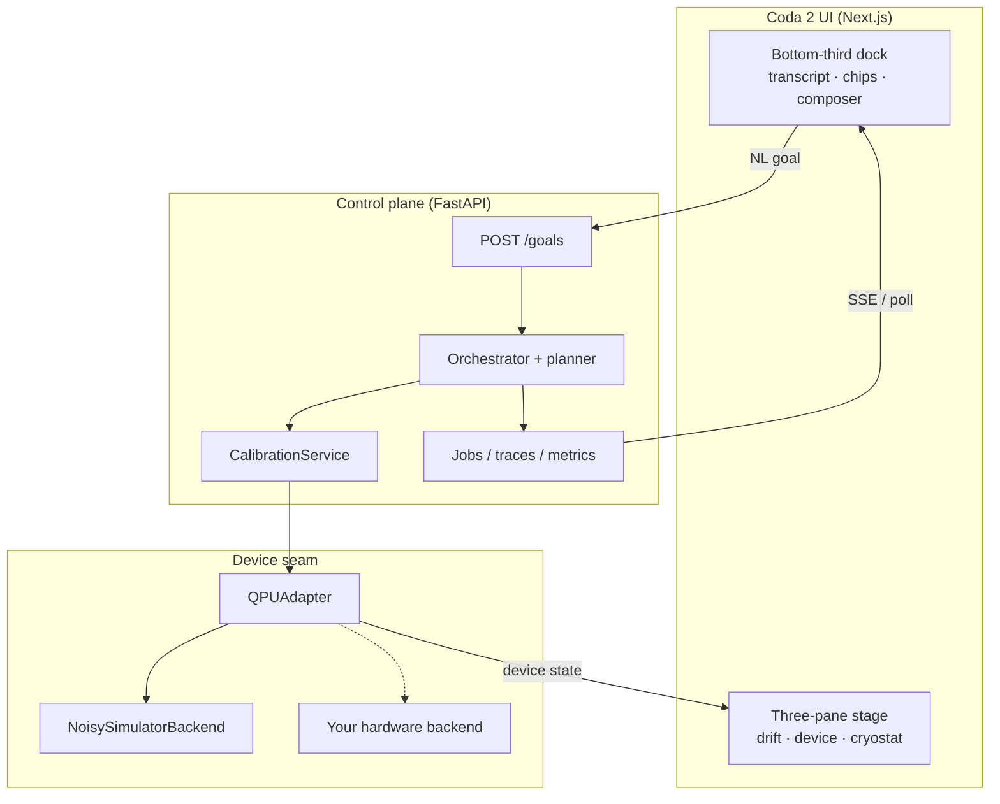
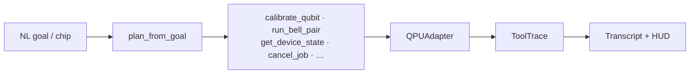

# Coda 2

**Natural language → quantum processing unit.** An instrument UI for operating a QPU with visual, text, and math at once.

Coda 2 turns short goals (“Bring qubit 0 to ready”, “Run a Bell pair”) into typed control-plane tools, shows live device physics on a three-pane stage, and keeps the conversation in a bottom-third chat dock. Offline by default. No API keys required for the core path.

[Technical manual (PDF)](docs/manual/coda-2-manual.pdf) · [Demo video](docs/media/demo.mov) · [Architecture plate](docs/diagrams/architecture.svg) · [UI layout](docs/diagrams/ui-layout.svg)

---

## One-liner

Talk to a quantum computer the way you talk to an instrument — multimodal (visual · text · math), not a chat void.

---

## Features

- **Three-pane instrument stage** — param-drift landscape · 3D device · isometric cryostat plate, with iPadOS-style splitters.
- **Bottom-third progressive dock** — transcript, suggestion chips, and high-contrast composer sit in a darkened band; top ~2/3 of the stage stays sharp (Safari-safe solid frost — no `backdrop-filter` on the dock).
- **Chat bubbles** — you / agent turns with tool-trace pills; empty-state and chips stay above the tint.
- **Workflow chips** — Calibrate Q0 · Bell pair · Q0 readiness · Device status · Improve Bell · Diagnose Q0.
- **Multimodal at once** — visual stage, natural-language goals, and live math (fidelity, Δf, mK, readiness).
- **Real control plane** — `QPUAdapter` seam, orchestrator + deterministic planner, calibration loop, jobs, traces, FastAPI + SSE.
- **Honest simulation** — `NoisySimulatorBackend` is a toy 1–2 qubit device with drift; swap the backend without touching UI or orchestrator.

---

## Demo

Local capture of the instrument in motion:

[`docs/media/demo.mov`](docs/media/demo.mov)


---

## Architecture






The adapter is the seam. Traces are the observability. The UI is an instrument, not a transcript-first chat app.

---

## Quick start

Prerequisites: Python 3.11+, Node 18+. No API keys for the default path.

```bash
git clone https://github.com/mariodelgado/coda-2.git
cd coda-2
make setup
```

**Terminal A — API**

```bash
make run-api
```

**Terminal B — UI** (keep `NEXT_PUBLIC_API_BASE` unset so same-origin `/qpu` rewrites work)

```bash
cd ui && env -u NEXT_PUBLIC_API_BASE npm run build
env -u NEXT_PUBLIC_API_BASE npx next start -H 0.0.0.0 -p 3000
# or for iteration:
# cd ui && env -u NEXT_PUBLIC_API_BASE npm run dev
```

Open http://localhost:3000.

`ui/lib/api.ts` defaults to `/qpu` when `NEXT_PUBLIC_API_BASE` is unset. The Next server rewrites `/qpu/*` → `http://127.0.0.1:8000/*`.

### First walk

1. Confirm **LIVE** in the toolbar.
2. Click **Calibrate Q0** — watch the climb HUD and drift pane.
3. Click **Q0 readiness** or **Device status** — get fidelity / readiness without running a circuit.
4. Click **Bell pair** (or **Improve Bell** for more shots) — read estimated fidelity in the transcript.
5. Use **Diagnose Q0** when the agent needs health / temperature context.

---

## Suggestion chips → tools

| Chip | Goal (approx.) | Planner tool |
|------|----------------|--------------|
| Calibrate Q0 | Bring qubit 0 to ready | `calibrate_qubit` |
| Bell pair | Run a Bell pair and report fidelity | `run_bell_pair` |
| Q0 readiness | Report qubit 0 readiness and fidelity status | `get_device_state` |
| Device status | Report device health and temperature status | `get_device_state` |
| Improve Bell | Run a precise Bell pair and report fidelity | `run_bell_pair` (more shots) |
| Diagnose Q0 | Check qubit 0 health and readout status | `get_device_state` |

---

## Layout notes (Safari-safe frost)

- **Top ~2/3** of the three panes stay optically sharp.
- **Bottom ~33vh** uses a dedicated `.stage-blur` sibling with **stacked solid translucent gradients** (no `backdrop-filter`). Historical Safari builds frosted the entire stage when `backdrop-filter` lived on `.dock`.
- `.dock` stays `pointer-events: none`; interactive children use `pointer-events: auto`.
- Transcript, empty state, chips, and composer use `position: relative; z-index: 1` so they paint above `.dock-tint`.


---

## Real vs simulated

**Real (control plane):** `QPUAdapter`, orchestrator + planner, tool traces, calibration service, FastAPI (`/goals`, `/jobs`, `/traces`, `/metrics`, `/device/*`, SSE), Next.js instrument UI.

**Simulated (hardware model):** `NoisySimulatorBackend` — hidden true params, drift, fidelity from distance, stochastic Bell counts. Replace the backend; keep the contract.

---

## Metrics that matter

- `time_to_calibrated`
- `calibration_success_rate`
- `interface_latency`

---

## Optional LLM planner / narrator

Deterministic planner + template narrator by default. Optional OpenAI-compatible providers (NVIDIA NIM, Groq, OpenAI) via env — see `src/conductor_qpu/orchestrator/planner.py`. Auto-enables when a key is present; always falls back to rules.

---

## License

See [LICENSE](LICENSE).
