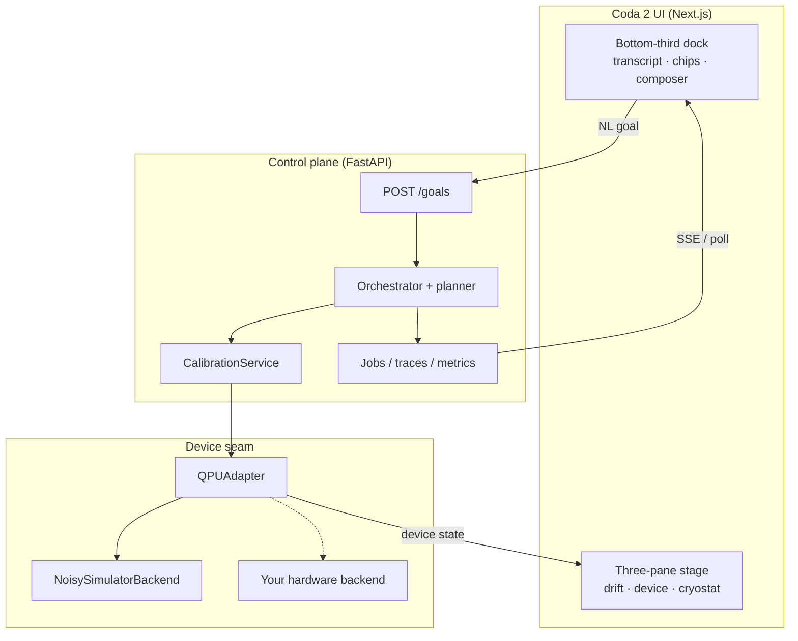
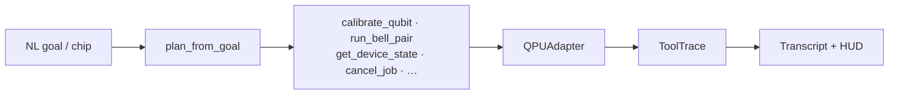

# [Coda 2](docs/manual/coda-2-manual.pdf)

**Natural language → quantum processing unit.**

An instrument UI for a QPU: visual, text, and math at once — not a chat void. Short goals (“Bring qubit 0 to ready”, “Run a Bell pair”) become typed control-plane tools. Live device physics fill a three-pane stage; conversation lives in a bottom-third dock. Offline by default. No API keys for the core path.

<p align="center">
  <a href="docs/diagrams/architecture.svg">Architecture</a>
  ·
  <a href="docs/diagrams/ui-layout.svg">UI layout</a>
</p>

<p align="center">
  <a href="docs/media/demo.webm">
    
  </a>
</p>

<video src="docs/media/demo.webm" poster="docs/media/demo-poster.png" controls width="100%">
  <a href="docs/media/demo.webm">Download the demo video (WebM)</a>
</video>

<p align="center">
  <a href="docs/media/demo.webm">Demo (WebM)</a>
  ·
  <a href="docs/media/demo.mov">Demo (MOV)</a>
</p>


---

## What you get

| | |
|---|---|
| **Three-pane stage** | Param-drift landscape · 3D device · isometric cryostat — iPadOS-style splitters |
| **Bottom-third dock** | Transcript, six suggestion chips, high-contrast composer — stage stays sharp above the fold |
| **Workflow chips** | Calibrate Q0 · Bell pair · Q0 readiness · Device status · Improve Bell · Diagnose Q0 |
| **Multimodal** | Visual stage + NL goals + live math (fidelity, Δf, mK, readiness) |
| **Chat bubbles** | You / agent turns with tool-trace pills; empty-state and chips stay above the tint |
| **Real control plane** | `QPUAdapter` seam, orchestrator + deterministic planner, calibration loop, jobs, traces, FastAPI + SSE |
| **Honest simulation** | `NoisySimulatorBackend` — toy 1–2 qubit device with drift; swap the backend without touching UI or orchestrator |

---

## How it works

A short natural-language goal becomes a **probabilistic program** on the device — not free-form chat.

1. **NL goal** — chip or typed ask (“Bring qubit 0 to ready”, “Run a Bell pair”).
2. **Planner** — maps the goal to typed control-plane tools (`calibrate_qubit`, `run_bell_pair`, `get_device_state`, …).
3. **Execution** — tools run through `QPUAdapter` on a noisy / probabilistic backend (drift, fidelity from distance, stochastic counts).
4. **Traces → UI** — tool traces, metrics, and live device state stream back into the transcript and three-pane stage.

Same seam for a real QPU: swap the backend; keep the planner, tools, and instrument UI.

---

## Architecture






The adapter is the seam. Traces are the observability. The UI is an instrument — not a transcript-first chat app.

---

## Quick start

**Prerequisites:** Python 3.11+, Node 18+. No API keys for the default path.

```bash
git clone https://github.com/mariodelgado/coda-2.git
cd coda-2
make setup
```

**Terminal A — API**

```bash
make run-api
```

**Terminal B — UI** (keep `NEXT_PUBLIC_API_BASE` unset so same-origin `/qpu` rewrites work)

```bash
cd ui && env -u NEXT_PUBLIC_API_BASE npm run build
env -u NEXT_PUBLIC_API_BASE npx next start -H 0.0.0.0 -p 3000
# or for iteration:
# cd ui && env -u NEXT_PUBLIC_API_BASE npm run dev
```

Open http://localhost:3000.

`ui/lib/api.ts` defaults to `/qpu` when `NEXT_PUBLIC_API_BASE` is unset. The Next server rewrites `/qpu/*` → `http://127.0.0.1:8000/*`.

### First walk

1. Confirm **LIVE** in the toolbar.
2. Click **Calibrate Q0** — watch the climb HUD and drift pane.
3. Click **Q0 readiness** or **Device status** — fidelity / readiness without running a circuit.
4. Click **Bell pair** (or **Improve Bell** for more shots) — estimated fidelity in the transcript.
5. Use **Diagnose Q0** when you need health / temperature context.

---

## Chips → tools

| Chip | Goal (approx.) | Planner tool |
|------|----------------|--------------|
| Calibrate Q0 | Bring qubit 0 to ready | `calibrate_qubit` |
| Bell pair | Run a Bell pair and report fidelity | `run_bell_pair` |
| Q0 readiness | Report qubit 0 readiness and fidelity status | `get_device_state` |
| Device status | Report device health and temperature status | `get_device_state` |
| Improve Bell | Run a precise Bell pair and report fidelity | `run_bell_pair` (more shots) |
| Diagnose Q0 | Check qubit 0 health and readout status | `get_device_state` |

---

## Dock stacking

- `.dock` stays `pointer-events: none`; interactive children use `pointer-events: auto`.
- Transcript, empty state, chips, and composer sit above `.dock-tint` (`position: relative; z-index: 1`).


---

## Real vs simulated

**Real (control plane):** `QPUAdapter`, orchestrator + planner, tool traces, calibration service, FastAPI (`/goals`, `/jobs`, `/traces`, `/metrics`, `/device/*`, SSE), Next.js instrument UI.

**Simulated (hardware model):** `NoisySimulatorBackend` — hidden true params, drift, fidelity from distance, stochastic Bell counts. Replace the backend; keep the contract.

---

## Metrics

- `time_to_calibrated`
- `calibration_success_rate`
- `interface_latency`

---

## Optional LLM planner / narrator

Deterministic planner + template narrator by default. Optional OpenAI-compatible providers (NVIDIA NIM, Groq, OpenAI) via env — see `src/conductor_qpu/orchestrator/planner.py`. Auto-enables when a key is present; always falls back to rules.

---

## License

[MIT](LICENSE)
